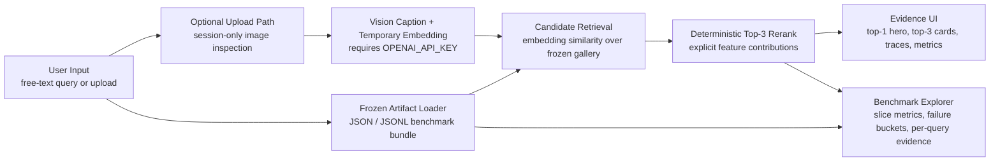
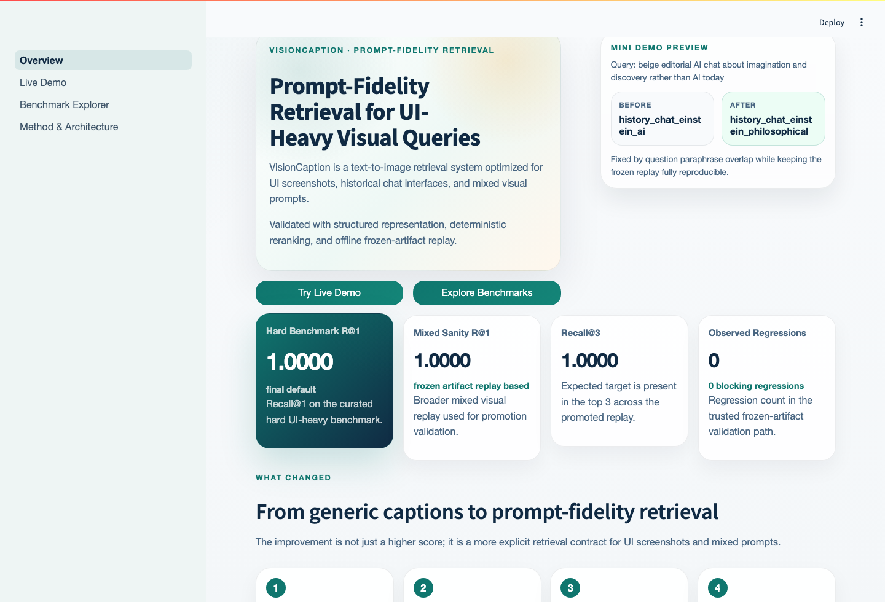
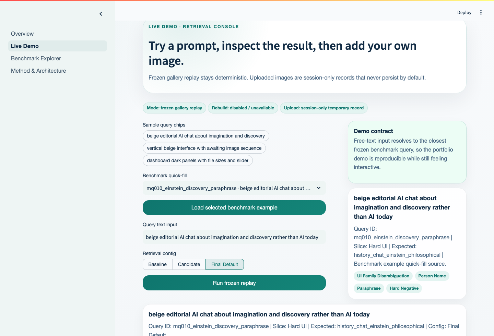
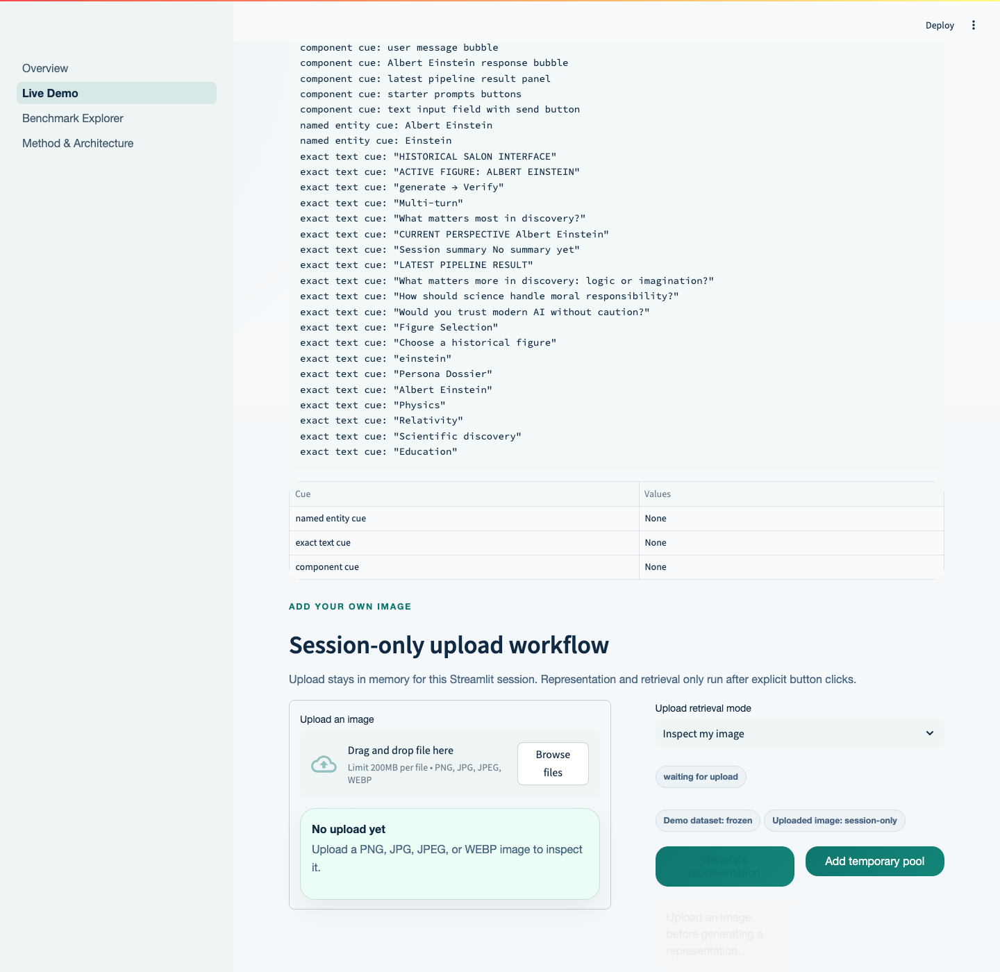
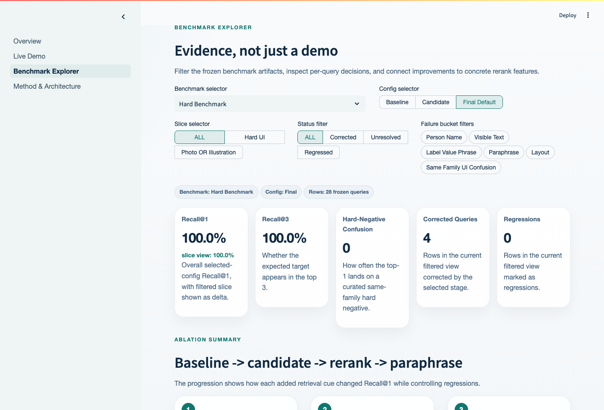
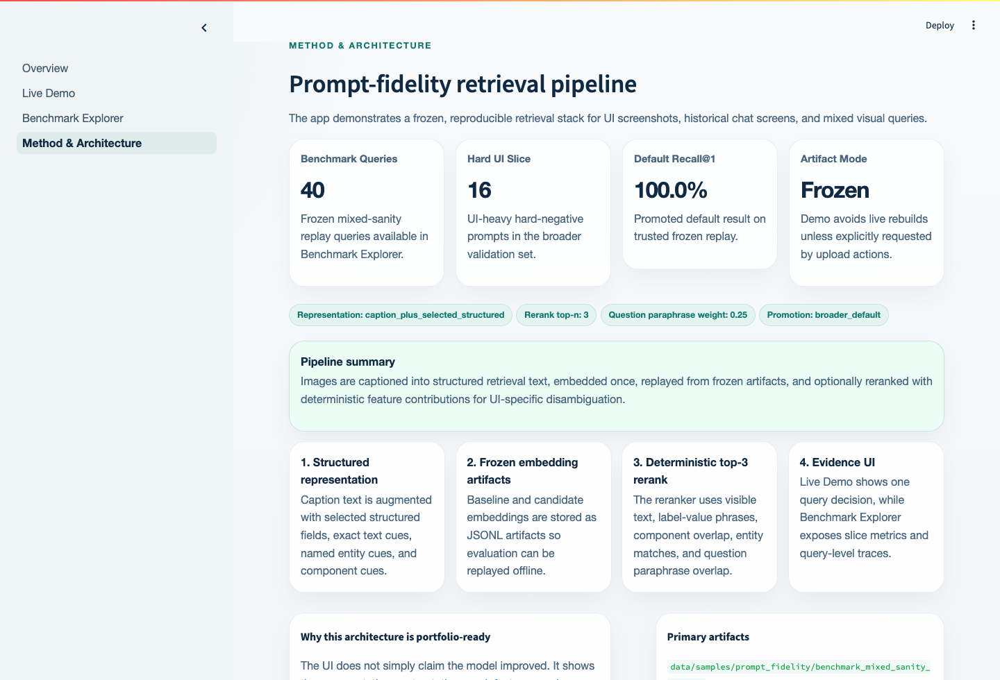

# VisionCaption

VisionCaption is an explainable image-retrieval app for UI screenshots, historical chat interfaces, and mixed visual prompts. A user enters a free-text query or optionally uploads an image, the app resolves that input against a validated artifact bundle, ranks candidate images, applies deterministic reranking when high-signal cues exist, and returns not only the final result but also the evidence behind it.

- GitHub: [soobincho-gif/VisionCaption_5](https://github.com/soobincho-gif/VisionCaption_5)
- Streamlit: [visioncaption5.streamlit.app](https://visioncaption5.streamlit.app)
- Submission notebook: [submission_package/실습4_조수빈.ipynb](submission_package/실습4_조수빈.ipynb)

## Why This Project Exists

Generic caption-based retrieval often performs reasonably on natural photos, but it struggles when the real signal is spread across visible text, named entities, layout structure, and UI components. VisionCaption was designed to handle that failure mode directly.

The project focuses on three practical questions:

- How do we retrieve the right image when two interfaces share the same overall style but differ in crucial on-screen cues?
- How do we correct top-1 ranking mistakes without turning the system into another opaque model call?
- How do we present retrieval quality in a way that stays reproducible and explainable?

The expected output is therefore broader than “one image ID.” The app returns a top result, top-3 comparison, rerank feature evidence, benchmark traces, and deployment-safe replay behavior.

## Main Features

- Frozen replay live demo that stays deterministic instead of rebuilding embeddings during every interaction
- Free-text query resolution that maps user input to the closest validated benchmark query for reproducible replay
- Three-stage retrieval comparison:
  - `baseline`: caption-only retrieval
  - `candidate`: caption plus selected structured fields
  - `final default`: deterministic top-3 rerank with paraphrase overlap
- Benchmark Explorer with slice filters, failure buckets, query-level evidence, and before/after analysis
- Deterministic rerank explanations using visible text, entity, label-value, component, and paraphrase cues
- Session-only image upload workflow for optional temporary comparison against the gallery
- Architecture and artifact pages that expose the underlying pipeline rather than hiding it

## System Architecture



## Design Decisions And Implementation Logic

### 1. Frozen replay is the default path

The core app is artifact-driven on purpose. Instead of regenerating embeddings at demo time, it loads trusted frozen outputs from `outputs/eval/`. That makes the UI stable, reproducible, and deployment-friendly.

### 2. Representation quality matters more than a larger black-box step

The jump from `caption_only` to `caption_plus_selected_structured` is one of the most important improvements in the project. UI-heavy queries benefit when the embedding input preserves exact visible text, named entities, layout blocks, and distinctive cues.

### 3. Rerank is explicit, small, and inspectable

The top-3 reranker is deterministic and intentionally narrow. It uses:

- exact visible-text overlap
- named-entity match
- label-value phrase overlap
- component cue overlap
- question paraphrase overlap
- a small original-similarity tie-break

That design keeps the final stage explainable. When a result changes, the app can show why.

### 4. UI state is organized around safe defaults

- The default demo path never depends on a live provider call.
- Upload state is kept in `st.session_state` and stays session-only.
- Missing secrets produce clear warnings rather than silent degradation.
- Missing artifacts raise explicit load failures instead of falling back to vague empty states.

### 5. Query resolution balances interactivity and reproducibility

The app accepts free-text input, but the demo contract maps it onto the closest frozen benchmark query. This preserves the feeling of interaction while keeping the displayed results benchmark-traceable.

## How The Implementation Evolved

The final system was built as a sequence of targeted improvements rather than one monolithic rewrite.

1. Repository scaffold, baseline caption indexing, and embedding indexing were established first.
2. Structured representation was added to improve retrieval fidelity for UI-heavy prompts.
3. Deterministic top-3 reranking was introduced to solve ordering mistakes when the correct image was already in the candidate pool.
4. Broader mixed-sanity validation confirmed that the promoted default stayed strong beyond the original hard benchmark.
5. The Streamlit UI, artifact loader, and documentation were shaped into a presentation-ready submission package.

The detailed implementation trail is preserved in [docs/logs](docs/logs).

## Current Validated Results

The promoted default was validated on April 10, 2026 using the frozen mixed-sanity replay.

| Stage | Recall@1 | Recall@3 | Notes |
| --- | ---: | ---: | --- |
| `caption_only` | 67.5% | 100.0% | baseline control |
| `caption_plus_selected_structured` | 87.5% | 100.0% | strong representation gain |
| `+ deterministic_top3_rerank` | 97.5% | 100.0% | top-1 ordering corrected |
| `+ question_paraphrase_overlap=0.25` | 100.0% | 100.0% | final promoted default |

Promoted default configuration:

- representation mode: `caption_plus_selected_structured`
- rerank: `deterministic_top3_rerank`
- rerank top-n: `3`
- question paraphrase overlap: `0.25`
- singleton low-signal container guard: enabled

## Expected Outputs And Example Results

What a user can expect to see in the app:

- a top-1 hero result with a short human-readable selection reason
- top-3 ranked result cards
- rerank feature contribution tables
- before vs after query comparisons
- slice-level benchmark metrics
- session-only upload inspection and temporary retrieval state

Representative query outcomes:

| Query | Before top-1 | Final top-1 | Key signal |
| --- | --- | --- | --- |
| dark dashboard for visual storytelling with controls and pipeline status | `visual_storytelling_mobile` | `visual_storytelling_dashboard` | label-value phrase overlap + component cues |
| beige editorial AI chat about imagination and discovery rather than AI today | `history_chat_einstein_ai` | `history_chat_einstein_philosophical` | question paraphrase overlap |
| beige Cleopatra chat screen with detailed answer cards | `history_chat_cleopatra_diplomacy` | `history_chat_cleopatra_diplomacy` | rerank stayed stable because top-1 was already correct |

## Screenshots

### Overview



The landing page frames the project as a prompt-fidelity retrieval system and surfaces the promoted default metrics immediately.

### Live Demo



The live demo shows the benchmark quick-fill workflow, chosen configuration, and the current top-1 explanation.

### Upload / Session-Only Path



The upload section makes it clear that uploaded images are temporary and that representation / retrieval happen only after explicit user actions.

### Benchmark Explorer



This page turns evaluation artifacts into explorable product evidence: slice filters, config filters, recall metrics, and per-query analysis.

### Method & Architecture



The architecture page exposes the pipeline and artifact contract directly inside the app.

## Submission Package

The repository includes a separate final submission package under [submission_package](submission_package).

Contents:

- [submission_package/실습4_조수빈.ipynb](submission_package/실습4_조수빈.ipynb): polished Korean notebook with logic, process, outputs, screenshots, and example results
- [submission_package/실습5_조수빈.ipynb](submission_package/실습5_조수빈.ipynb): same content saved under the alternate filename requested during preparation
- `submission_package/assets/screenshots/`: execution screenshots used in the notebook
- `submission_package/assets/sample_images/`: representative benchmark images used in the notebook examples
- `submission_package/assets/diagrams/`: architecture diagram assets

## How To Run Locally

### Requirements

- Python `3.12`
- packages from [requirements.txt](requirements.txt)
- optional `OPENAI_API_KEY` if you want to use the upload caption / temporary embedding path

### Install

```bash
python -m venv .venv
source .venv/bin/activate
pip install -r requirements.txt
```

### Optional environment setup

For upload captioning and temporary embedding:

```bash
cp .streamlit/secrets.toml.example .streamlit/secrets.toml
```

Then edit:

```toml
OPENAI_API_KEY = "sk-your-openai-key"
```

### Launch

```bash
streamlit run app.py
```

Entrypoint:

```text
app.py
```

## Streamlit Deployment

This project is configured for Streamlit Community Cloud deployment.

- repository: `soobincho-gif/VisionCaption_5`
- branch: `main`
- main file path: `app.py`
- Python: `3.12`
- dependency file: `requirements.txt`
- config file: `.streamlit/config.toml`
- optional secrets template: `.streamlit/secrets.toml.example`

Deployment assumptions:

- the frozen artifacts inside `outputs/eval/` remain committed
- the default demo path should not depend on live rebuilds
- `OPENAI_API_KEY` is optional and only needed for the session-only upload path

Current deployment link:

- [visioncaption5.streamlit.app](https://visioncaption5.streamlit.app)

Operational note:

- if Streamlit Cloud is switched to restricted sharing, anonymous visitors may be redirected to Streamlit auth; keeping the app publicly shareable requires the app’s sharing setting to stay public

## Repository Structure

```text
app.py
src/
  config/                 prompts, settings, experiment definitions
  core/                   representation and deterministic rerank logic
  pipelines/              offline evaluation and ablation scripts
  services/               provider-facing caption / embedding boundaries
  storage/                JSONL loading and persistence helpers
ui/
  pages/                  Streamlit page renderers
  components/             reusable UI cards and panels
  utils/                  artifact loading, formatting, upload helpers
data/
  samples/                benchmark definitions and benchmark images
outputs/
  eval/                   frozen evaluation artifacts used by the app
docs/
  logs/                   dated implementation and experiment notes
assets/
  screenshots/            README screenshots
  diagrams/               architecture assets
submission_package/
  assets/                 notebook-ready screenshots, diagrams, sample images
  실습4_조수빈.ipynb      polished final notebook
```

## Limitations And Future Improvements

Current limitations:

- the default app path is benchmark-replay oriented, not an unrestricted live retrieval engine
- the upload path depends on `OPENAI_API_KEY` for new caption / embedding generation
- deterministic rerank is tuned to the current failure shape and should be validated on broader datasets before generalization claims are expanded

Useful next steps:

- extend the benchmark pool with more hard negatives and broader UI families
- refine upload-path diagnostics and clearer warning surfacing
- continue hardening the Benchmark Explorer cards and drilldowns
- keep Streamlit sharing settings stable so the live link remains broadly accessible
